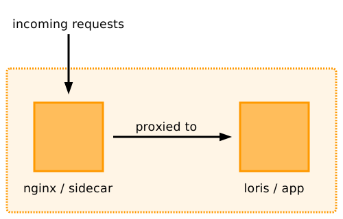

# nginx

This directory contains the nginx configuration we used for Loris.

When we ran Loris in ECS, we ran two containers per task – Loris (the "app" container) and nginx (the "sidecar").

Incoming requests from outside the task were sent to Loris, which would proxy those requests to Loris.
This allowed us to do a bit of path manipulation before requests reached Loris, and run a relatively unmodified instance of Loris itself.
This app/sidecar pattern is fairly common in our applications.



To build this image, run:

```console
$ docker build --tag loris_nginx .
```